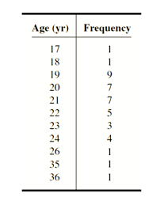

# Term 3 Week 1!


## Teletrip
https://orac2.info/problem/1299/
<details>
<summary>Hint 1</summary>

> What value do we want to keep track of? How does it change if the instruction is 'L', 'R' or 'T'?
    
</details>
<details>
<summary>Hint 2</summary>

> Consider a farmhouse to the right of your own. Which farmhouses do we have to visit in order to get here? Is it possible to reach this spot while skipping some houses?

</details>
<details>
<summary>Solution</summary>

> To find how many farmhouses we have visited, we ONLY need to know the farthest right we've been and the farthest left. Say our own house is at 0. It is impossible to go to house 3, without first visiting house 1 or house 2. 
Therefore, we simulate the movement and keep track of our current position, say starting from 0. If 'L', then position decreases, vice versa for 'R'. If 'T', `position = 0`.
Every time after moving, we have to update leftmost and rightmost position.
At the end, the number of houses we've visited is `right - left + 1`.

</details>


## Distincto's Raffle
https://orac2.info/problem/1302/
See Recap on arrays for imeplementation help.
<details>
<summary>Hint 1</summary>
> We want to count how many times each number is submitted. 
</details>

## Tag
https://orac2.info/problem/225/

# Recap on arrays:

In order to make all numbers in the array start from zero, you can either use

```c++
int main() {

    int array[10] = {};
    int another_example[25] = {};
}
```

OR

```c++
int array[10];

int main() {
    //...
}
```

## Counting Frequency
One use of arrays is to count occurences/make a frequency distribution table. For example, ages:



In this case the `Age`, e.g. 17 will be our index, and the frequency is stored inside the array at that index. Note that these methods don't let you make variable length arrays, e.g. `int array[n] = {}`.

`int ages[50] = {}` will initialise an empty array

`int ages[17] = 1` will set the frequency of 17 to 1

`int ages[17] += 1` will increase the frequency of 17 by 1

`ages[17]` will give us the frequency of 17