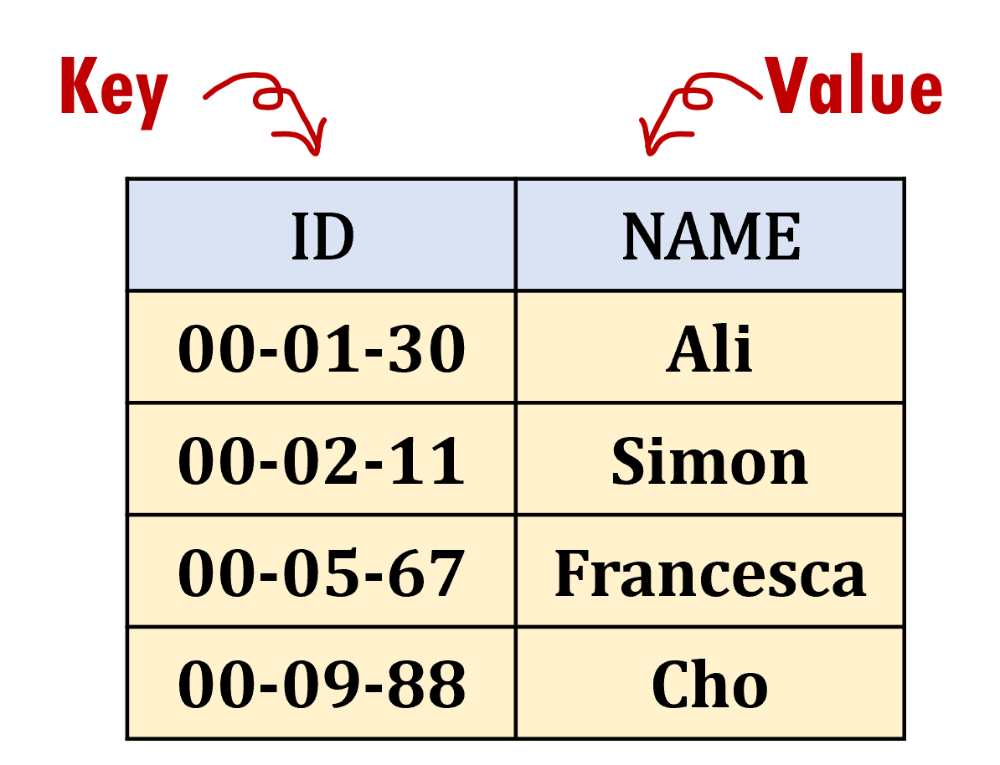

# Week 4: Dictionaries!

A dictionary is a data structure which allows us to store items, like arrays. However, dictionaries use key-value pairs instead of indexes.

## Problems:

### Dictionary
* https://orac2.info/problem/338/

### Ghost Encounters
* https://orac2.info/problem/211/

