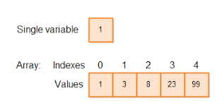

# **Week 3: More Arrays!!!**

Arrays are used to store multiple values, instead of making many different variables.

**Ways to declare an array in c++:**

Creating an empty array: <br>
```c++
int array[5];
```

Creating an array with pre defined values: <br>
```c++
int array[5] = {1, 5, 3, 7, 4};
```

Creating an array initialised to 0: <br>
```c++
int array[5] = {0};
```

**Accessing array elements** <br>


```c++
int array[5] = {1, 5, 3, 7, 4};

array[3]; // will give you 7, can use this as any variable
array[3] = 5; // assigns/puts 5 into the array index 3, like a variable
array[3] += 2; // adds 2 to whatever is in array index 3
```

**Reading input into array**

```c++
int length;
cin >> length; // first, we need to know the size of the array to allocate

int array[length]; // then, we create an array of that size

for (int i = 0; i < length; i++) { // going from indexes 0 to length - 1, we fill in the array
    cin >> array[i];
}
```

**Applications of arrays** 

Arrays are a simple yet versatile data structure. We can use them to simply hold values, count values or index values.

**Problems**
* Triple Hunting
* Friendlist
* Snap Dragons
* TSP
* Castle Cavalry